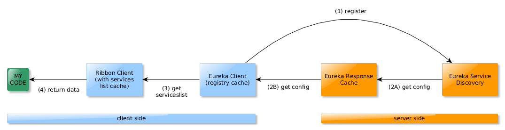

* 이 글은 원본의 글쓴이에게 번역 허락을 받고 쓴 글입니다. 저의 의견도 포함해서 적었습니다.

Netflix OSS를 사용하고 있는 Spring Cloud로 application architecture를 개발을 하고 있습니다.

#### [문제점] Wait until the Ribbon client is ready to serve 
기본적으로 Eureka 서버에서 서버 목록을 가져 오기 전에 30초 동안 기다리고 나서 리본의 로드 밸런서를 사용해서 특정 서비스로 라우팅을 할 수가 있습니다.

위와 같은 문제는 개발환경이 dev, local인 경우 빈번히 restart를 하는데 결과를 보려고 할 때마다 30초를 기다려야하는 고통이 따른다.

#### 기본적인 유레카 서버 configuration
```java
@SpringBootApplication
@EnableEurekaServer
public class EurekaApplication {

    public static void main(String[] args) {
        SpringApplication.run(EurekaApplication.class, args);
    }

}

```
```
server.port=8761
spring.application.name=eureka-server

eureka.client.register-with-eureka=false
eureka.client.fetch-registry=false
eureka.client.service-url.defaultZone = http://127.0.0.1:8761/eureka
eureka.instance.ip-address=true
```

#### 그리고 client configuration
```
spring.application.name=appName
server.port=9999
eureka.instance.prefer-ip-address=true
eureka.client.service-url.defalutZone=http://127.0.0.1:8761/eureka
```

유레카 서버에 'appName'으로 등록이 되면 plain URL 대신 리본의 로드밸런스 RestTemplate와 appName (service name)으로 접근이 가능하다.
http://localhost -> http://appName으로 remote call이 가능하게 된다. 이렇게 유레카 서버에 등록된 서비스명으로 접근하기 위해선 최소 30초의 초기화시간이 필요하다.

#### log를 보자
```
logging:
  level:
    com:
      netflix:
        loadbalancer: debug
```

```
$ tail -f appName.log | grep "addServer\|clearing"
DEBUG 19080 --- [erListUpdater-0 c.netflix.loadbalancer.BaseLoadBalancer  : LoadBalancer [appName_defaultzone]:  addServer [192.168.0.14:9999]
```
 addServer 까지의 시간이 30초가 걸린다.



```
참조
http://lifeinide.com/post/2017-12-07-instant-ribbon-client-init-with-eureka/
```