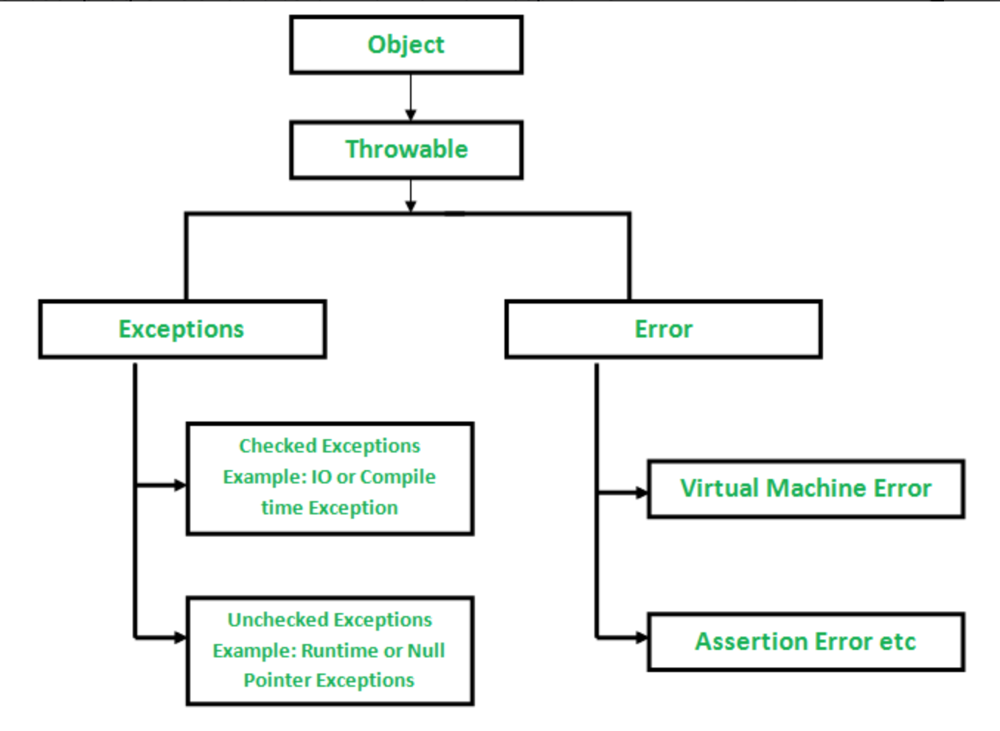

#### What is an Exception?
예외는 프로그램 실행 중에 발생하는 예상치 못한 이벤트로 프로그램의 흐름을 방해

#### Error
- 오류(Error)는 시스템에 비정상적인 상황이 생겼을 때 발생, 시스템 레벨에서 발생하기에 심각한 수준의 오류이며 개발자가 미리 예측하여 처리하기 어려움

#### Exception
- 오류가 시스템 레벨에서 발생한다면, 예외(Exception)는 개발자가 구현한 로직에서 발생
- 예외는 발생할 상황을 미리 예측하여 처리가 가능


#### Exception Hierarchy

모든 예외 및 오류 유형은 Throwable 클래스의 하위 클래스


#### Exceptions Object
- Exceptions 는 개발자가 포착해야하는 예외
- Checked Excpetions or Unchecked Exceptions

#### Checked Exceptions
컴파일할 때 예외를 확인, 예외가 발생 시 빌드 중단
프로그램상에서 강제로 예외처리를 해줘야함

ex) SqlException, IOException

#### Unchecked Exceptions
컴파일할 때 잡지 않는 예외
따라서 컴파일러가 예외처리를 강요하지 않으며, 프로그래머가 throws or try catch 를 통해 핸들링 함.
ex) RuntimeException, NullPointException

### How JVM handle an Exception?

#### Default Exception Handling
메소드 내부에서 예외가 발생하면 메소드는 Exception Object를 생성하여 런타임 시스템인 JVM에 전달.
* Exception Object를 생성하고 런타임 시스템이 처리하는 것을 Throwing an Exception 이라고 함.
* 예외가 발생한 메서드의 리스트를 Call Stack 이라고 부름
- 런타임 시스템은 Call Stack 을 검색하여 발생한 예외를 처리할 수 있는 코드 블럭이 포함된 메서드를 찾음(코드 블럭을 Exception Handler 라고 부름)
- 런타임 시스템은 예외가 발생한 메서드에서 검색을 시작하고 호출된 역순으로 진행
- 적절한 핸들러를 찾으면 발생한 예외를 전달 (exception object type에 맞춰서 처리기가 진행)
- 적절한 핸들러를 찾지 못하면 기본 예외 핸들러로 넘김 (비정상 종료)

### How Programmer handles an exception?

#### Customized Exception Handling
Java 예외 처리는 try, catch, throw, throws 및 finally의 키워드를 통해 관리

```
출처
https://www.geeksforgeeks.org/exceptions-in-java/
https://www.geeksforgeeks.org/checked-vs-unchecked-exceptions-in-java/


```